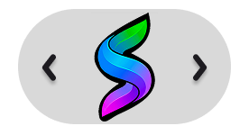

<div align="center">

  

  # SpectraNote
  ### *The Invisible Bridge Between Your Active Workspace and Notes*

  <p align="center">
    <strong>A high-performance, non-intrusive floating HUD designed for researchers, students, and engineers to capture, format, and organize content into Word documents in real time.</strong>
  </p>

  <p align="center">
    <a href="https://www.python.org/downloads/"></a>
    <a href="https://microsoft.com/word"></a>
    <a href="#"></a>
    <a href="#"></a>
    <a href="#"></a>
  </p>

  <br />

  
  
  <p><sub><i>Fig 1.0: SpectraNote Full Floating Interface (Left Utilities • Center Drag/Toggle • Right Formatting)</i></sub></p>

  
  
  <p><sub><i>Fig 1.1: Collapsed Minimalist Pill — zero distraction, ready on demand</i></sub></p>

</div>

---

## 🧭 Table of Contents

- [💡 The Problem & The Solution](#-the-problem--the-solution)
- [✨ Key Features](#-key-features)
- [🧩 Architecture & Design Decisions](#-architecture--design-decisions)
- [🛠️ Technical Challenges & Creative Solutions](#-technical-challenges--creative-solutions)
- [📁 Project Directory Structure](#-project-directory-structure)
- [🎮 Toolbar Controls & Cheatsheet](#-toolbar-controls--cheatsheet)
- [🚀 Quickstart & Installation](#-quickstart--installation)
- [🔮 Roadmap](#-roadmap)

---

## 💡 The Problem & The Solution

### The Friction of Traditional Research
```
[ Read Article ] ──> [ Select Text ] ──> [ Ctrl+C ] ──> [ Alt+Tab to Word ]
                           ▲                                      │
                           │                                      ▼
                   [ Context Loss ] <── [ Style/Fix Format ] <─── [ Ctrl+V ]
```
Every time you switch between browsers, PDF viewers, video streams, and Microsoft Word:
1. **Focus breaks** due to repeated window context switching.
2. **Clipboard history gets polluted** and formatting gets lost.
3. **Pasted text requires manual styling** (H1, bold, list bullet indents).
4. **Snipping and embedding images** requires saving temp files or tedious manual paste/resize loops.

---

### The SpectraNote Experience
```
[ Highlight Text / Area ] ──> [ Click SpectraNote Floating Button ] ──> [ Instantly Formatted in DOCX ]
                                      (Zero Window Switching)
```
SpectraNote floats silently above your open windows. You simply highlight text or an on-screen visual anywhere, tap a single HUD button, and SpectraNote extracts, formats, and writes the structured block directly into your active Microsoft Word `.docx` file **without ever deselecting your active window**.

---

## ✨ Key Features

| Feature | Description |
| :--- | :--- |
| 👻 **Ghost HUD Window (`WS_EX_NOACTIVATE`)** | Borderless, transparent floating toolbar built with low-level Win32 hooks that **never steals focus** from your browser or PDF reader. |
| ✍️ **1-Click Semantic Word Formatting** | Instantly appends selected text as `Normal`, `Heading 1`, `Heading 2`, `Bold`, `Italic`, `Underline`, or `List Bullet` into your document. |
| ✂️ **Multi-Shape Snipping Tool** | Built-in high-resolution screen capture supporting **Rectangular**, **Circular**, and **Freehand Lasso** selections with automatic alpha-masking and Word insertion. |
| 📺 **YouTube Research Injector** | Pulls related video suggestions based on selected text, displays thumbnails, and inserts clickable OpenXML hyperlinks (`w:hyperlink`) directly into your notes. |
| 🌐 **Instant Web Search** | Automatically captures highlighted terms and launches focused web search queries in your default browser. |
| 🔄 **In-Flight Note Switching (`new_note`)** | Switch destination documents or generate a fresh note file mid-session without restarting the engine. |
| 🖥️ **Adaptive Multi-Monitor Scaling** | Automatically reads monitor bounds via `screeninfo` and clamps drag boundaries seamlessly across displays. |
| 🔕 **System Tray Background Daemon** | Runs unobtrusively in the Windows system tray with quick-launch and graceful shutdown triggers. |

---

## 🧩 Architecture & Design Decisions

SpectraNote is engineered around a **Decoupled 3-Layer Modular Architecture** combined with a **State-Return Loop Engine**.

<div align="center">
  
</div>

---

## 🛠️ Technical Challenges & Creative Solutions

### 1. The Active Focus Hijacking Challenge
* **The Problem**: Standard GUI windows in Python (Tkinter, PyQt) automatically request OS focus upon creation or user interaction. Clicking a floating toolbar would deselect text in the browser/PDF, causing clipboard extraction to fail.
* **The Solution**: We tapped directly into the Windows User32 Subsystem using `ctypes`:
  ```python
  # Apply WS_EX_NOACTIVATE style so window never steals window focus
  GWL_EXSTYLE = -20
  WS_EX_NOACTIVATE = 0x08000000
  style = ctypes.windll.user32.GetWindowLongW(hwnd, GWL_EXSTYLE)
  ctypes.windll.user32.SetWindowLongW(hwnd, GWL_EXSTYLE, style | WS_EX_NOACTIVATE)
  ```

---

### 2. Tkinter Event-Loop Blocking & State-Return Engine
* **The Problem**: Long document I/O operations, image rendering, or network requests inside Tkinter's `mainloop()` cause the dreaded Windows *"Not Responding"* UI freeze.
* **The Solution**: SpectraNote uses a **State-Return Execution Cycle**:
  1. The toolbar renders on a lightweight `Toplevel` and enters a non-blocking wait.
  2. On user action, it updates `AppData.style` and immediately tears down the local widget tree.
  3. Control falls back to `runner.py` to execute document writes, screen captures, or API queries.
  4. Once complete, the toolbar cleanly re-instantiates in milliseconds.

---

### 3. OpenXML Native Hyperlink Injection
* **The Problem**: `python-docx` lacks out-of-the-box support for generating interactive, styled hyperlinks in document paragraphs without raw XML.
* **The Solution**: We built a custom OpenXML injection utility (`doc_task/hyperlink_helper.py`) that binds document relationships directly:
  ```python
  r_id = part.relate_to(url, 'http://schemas.openxmlformats.org/officeDocument/2006/relationships/hyperlink', is_external=True)
  hyperlink = OxmlElement('w:hyperlink')
  hyperlink.set(qn('r:id'), r_id)
  # Formats run with blue color (#0000FF) and single underline
  ```

---

### 4. Zero-Key YouTube Suggestion Integration
* **The Problem**: Requiring users to configure a Google Cloud Console account and generate a YouTube Data API Key adds massive friction for non-technical users.
* **The Solution**: We decoupled the YouTube Suggestion Engine into a multi-tiered provider architecture that queries YouTube's public web endpoints with zero API keys required, while feeding structured results into a modular preview popup.

---

### 5. In-Flight Workspace Switcher (`new_note`)
* **The Problem**: Switching target documents mid-session without restarting background daemons or crashing Tkinter with duplicate root instances.
* **The Solution**: Parameterized `start_folder_selection(app_data, parent=root, is_startup=False)`. During runtime, it launches as a transient modal with `grab_set()` and `wait_window()`. If the user closes `[X]`, it safely cancels without modifying `AppData` or triggering `sys.exit`.

---

## 📁 Project Directory Structure

```text
SpectraNote/
├── 📜 runner.py                    # Main Lifecycle & State-Return Engine
├── 📦 appdata.py                   # Central State Management & Path Config
├── 📋 requirements                 # Project Dependency Declarations
├── 🔒 .env.example                 # Environment Variable Template
│
├── 🧠 handlers/                    # Action & Business Logic Handlers
│   ├── __init__.py
│   ├── yt_handler.py               # YouTube Search & Link Injection Orchestrator
│   └── web_search_handler.py       # Instant Web Search Dispatcher
│
├── 🎨 gui/                         # Pure Presentation & UI Components
│   ├── gui_runner.py               # Floating SpectraToolbar Controller
│   ├── gui_layout.py               # Responsive Screen Measurements & Anchor Map
│   ├── gui_loader.py               # Transparent PNG Asset & Icon Loader
│   ├── gui_destination_selector.py # Startup & In-Flight Workspace Selector
│   ├── gui_yt_selector.py          # YouTube Suggestions Modal Selector
│   └── assets/                     # High-DPI UI Asset Library
│
├── 📸 SnapShot_task/               # Vision & Screen Capture Suite
│   ├── SS_auto_doc_appending.py    # Multi-Shape Snipping Tool (Rect, Circle, Freehand)
│   ├── image_appender.py           # Auto-Scaling Image Importer for Word
│   └── assets/                     # Snipping Tool HUD Controls
│
├── 📄 doc_task/                    # Document Manipulation & OpenXML Suite
│   ├── doc_manager.py              # Word File Creation & Validation
│   ├── operation.py                # Paragraph Styler (H1, H2, Bold, Italic, Bullet)
│   ├── hyperlink_helper.py         # OpenXML Hyperlink & URL Appender
│   └── text_extractor.py           # Native Clipboard Extraction Driver
│
├── 🔕 task_bar_menu/               # System Integration & Daemons
│   ├── tray_icon.py                # Windows System Tray Daemon (pystray)
│   └── icon.png                    # Tray Icon Asset
│
└── 🖼️ public_images/               # Documentation & Showcase Media
```

---

## 🎮 Toolbar Controls & Cheatsheet

<div align="center">
  
</div>

<br>

### 🔹 Left Panel — Utilities & Actions
| Icon | Action | Description |
| :---: | :--- | :--- |
| 📁 | **Open Folder** | Opens the folder containing your active `.docx` file in Windows Explorer. |
| 📄 | **Open File** | Instantly launches the active `.docx` file in Microsoft Word. |
| 📝 | **New Note** | Opens the workspace selector to switch or create another document. |
| ⚡ | **Summary** | *(Upcoming)* AI-driven document summarization. |
| 🌐 | **Web Search** | Encodes highlighted text and triggers a browser web search. |
| ✂️ | **Snapshot** | Launches the multi-shape snipping tool to capture and embed images. |
| ▶️ | **YouTube** | Searches YouTube for highlighted text and embeds chosen video links. |

### 🔹 Center Panel — Navigation & Controls
| Icon | Action | Description |
| :---: | :--- | :--- |
| ◀️ / ▶️ | **Toggle Panels** | Collapses left/right toolbars into a micro pill HUD. |
| ✥ | **Drag Anchor** | Smooth drag handle with multi-monitor boundary clamping. |

### 🔹 Right Panel — Semantic Text Formats
| Icon | Format | Word Style Output |
| :---: | :--- | :--- |
| **P** | **Normal** | Inserts text as clean standard paragraph (`Normal`). |
| **I** | **Italic** | Inserts text with italic emphasis. |
| **B** | **Bold** | Inserts text with strong bold weighting. |
| **H1** | **Heading 1** | Formats text with major section header styling. |
| **H2** | **Heading 2** | Formats text with sub-section header styling. |
| **•** | **Bullet** | Formats text as an indented list item (`List Bullet`). |
| **✕** | **Exit** | Gracefully closes the toolbar and stops tray daemons. |

---

## 🚀 Quickstart & Installation

### Prerequisites
* **Operating System**: Windows 10 or Windows 11
* **Python**: `3.8+` (Recommended: Python 3.10 / 3.11)
* **Office Suite**: Microsoft Word or any `.docx`-compatible viewer

### 1. Clone the Repository
```bash
git clone https://github.com/yourusername/SpectraNote.git
cd SpectraNote
```

### 2. Set Up a Virtual Environment
```bash
python -m venv .venv
.venv\Scripts\activate
```

### 3. Install Required Dependencies
```bash
pip install -r requirements
```

### 4. Launch SpectraNote
```bash
python runner.py
```

---

## 🔮 Roadmap

- [x] **Modular 3-Tier Layering (`handlers/`, `gui/`, `doc_task/`)**
- [x] **In-Flight Document Switching (`new_note`)**
- [x] **Multi-Shape Screen Capture with Alpha Masks**
- [x] **Native OpenXML Hyperlink Generation**
- [ ] **Context-Aware AI Assistant (Sidebar Copilot)**
- [ ] **Real-Time Text Translation before Document Injection**
- [ ] **Cloud Workspace Sync (Google Docs & Notion API Integration)**
- [ ] **Next-Gen Modern UI Framework Transition**

---

<div align="center">
  <sub>Crafted with ❤️ for streamlined research & frictionless note-taking.</sub>
</div>
